<div align="center">
  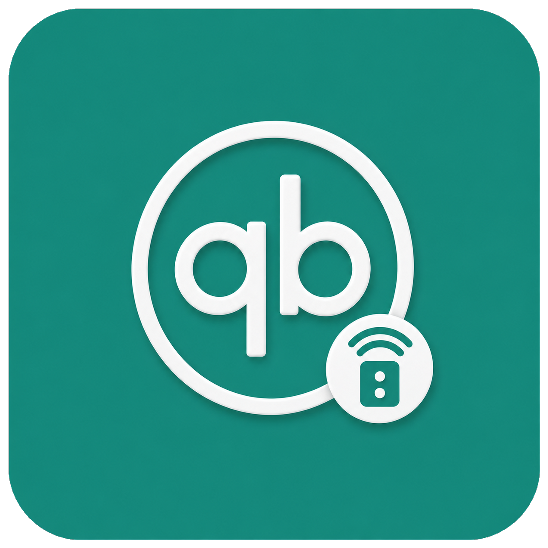
  <h1>qBPanel</h1>
  <p>A Flutter client for remotely managing qBittorrent via the WebUI API</p>
  <p>
    <a href="README.md">中文</a> | <b>English</b>
  </p>
  <p>
    
    
    
    
  </p>
</div>

qBPanel is not a BitTorrent engine. It is a **remote panel** that talks to a qBittorrent instance with WebUI enabled—on a NAS, a PC, or a VPS. You can watch progress, add torrents, and change server preferences from a Material 3 app that follows the desktop WebUI’s usual workflows.

## Features

- **Multiple servers**: add, edit, and switch instances; HTTPS and a custom path (for reverse proxies such as `/nas/qb`)
- **Sign-in**: WebUI username and password, or an API key on qBittorrent 5.2+
- **Torrent list**: live polling of progress and speeds; search; filter by status, category, and tags; several sort keys; standard or compact rows
- **Add torrents**: magnet links, HTTP(S) URLs, and local `.torrent` files; save path, category, rename, and TMM
- **Open from the system**: on Android, open or share `.torrent` files and `magnet:` links; on Windows, import via launch arguments or drag-and-drop (the app does not register as a default handler or write to the registry)
- **Torrent actions**: start / stop / force start, delete, set location, rename, category and tags, speed and share limits, sequential download, recheck, reannounce, queue, export `.torrent`
- **Torrent details**: general (piece bar, availability, speed chart), peers (IPv4 / IPv6 and client info), file priorities, trackers, HTTP seeds
- **Search**: qBittorrent search plugins—install, enable, and update
- **Logs**: server logs and banned IPs, filterable by severity
- **Remote preferences**: Behavior, Downloads, Connection, Speed, BitTorrent, WebUI, and Advanced (these apply to the qBittorrent server, not to this app)
- **Appearance**: system / light / dark, Material You dynamic color, custom seed color
- **Languages**: follow the system, Simplified Chinese, Traditional Chinese, English

## Screenshots

<table>
  <tr>
    <td align="center">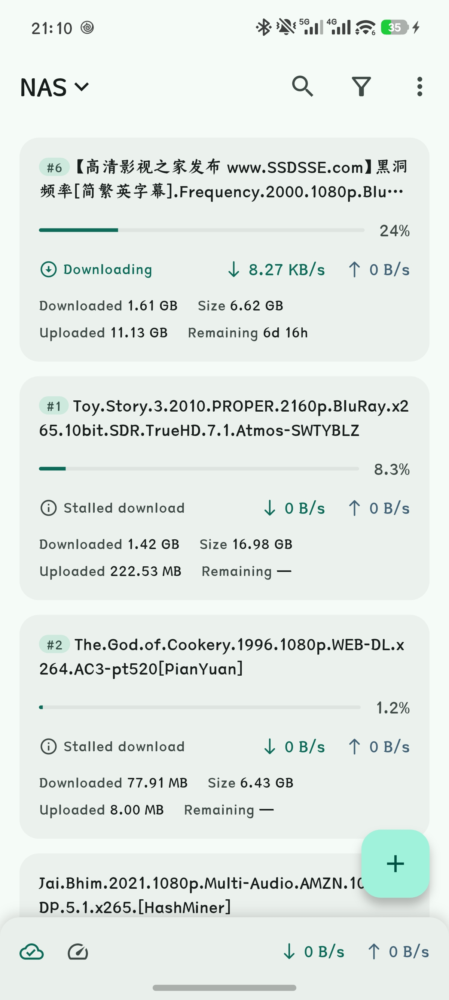<br/>Home</td>
    <td align="center">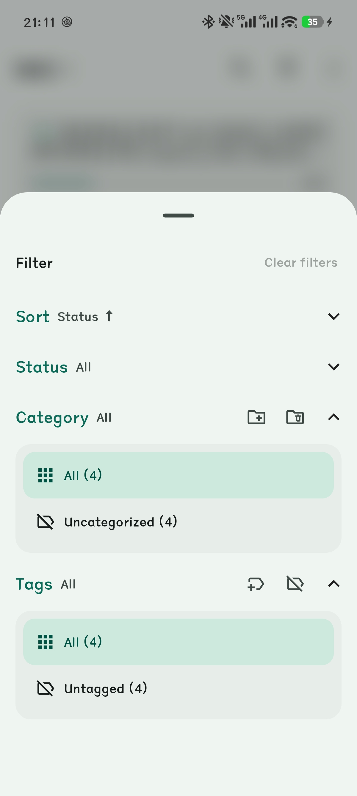<br/>Filter and sort</td>
    <td align="center">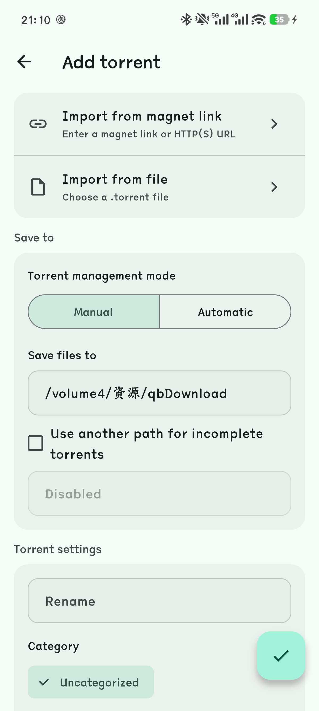<br/>Add torrent</td>
  </tr>
  <tr>
    <td align="center">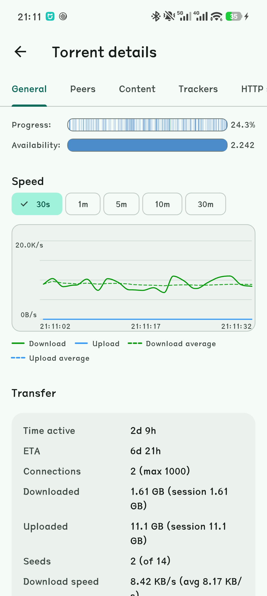<br/>Details · General</td>
    <td align="center">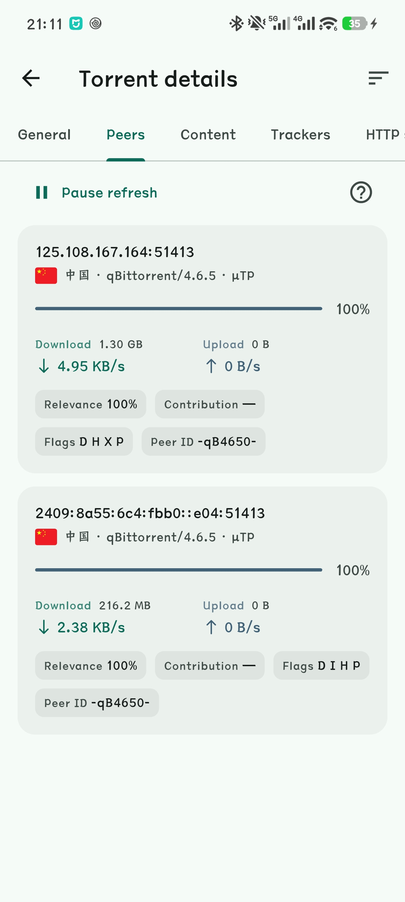<br/>Details · Peers</td>
    <td align="center">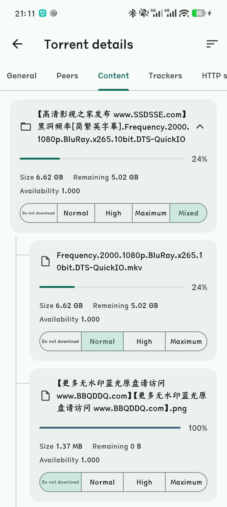<br/>Details · Content</td>
  </tr>
  <tr>
    <td align="center">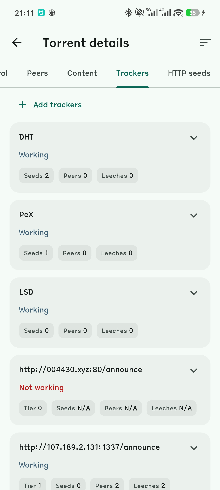<br/>Details · Trackers</td>
    <td align="center">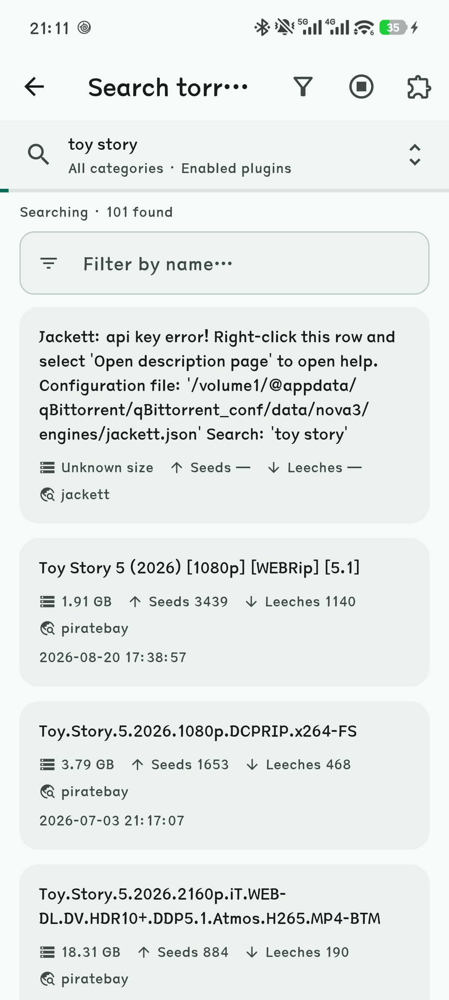<br/>Search</td>
    <td align="center">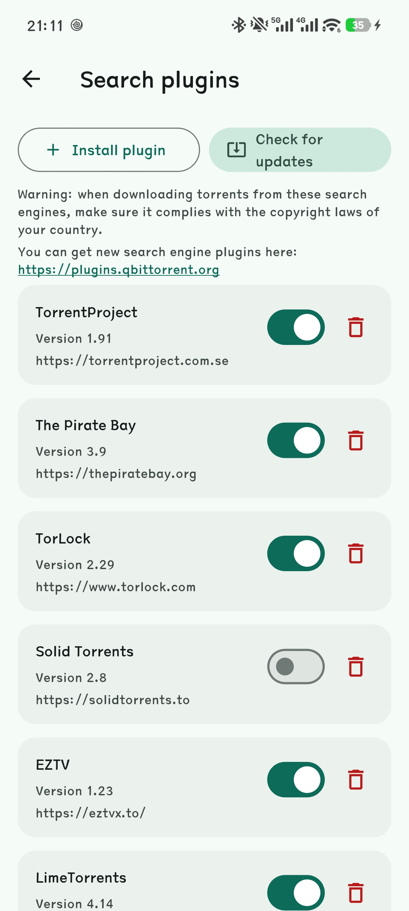<br/>Search plugins</td>
  </tr>
  <tr>
    <td align="center">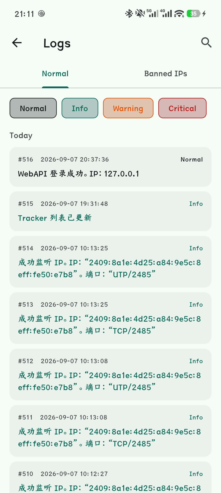<br/>Logs</td>
    <td align="center">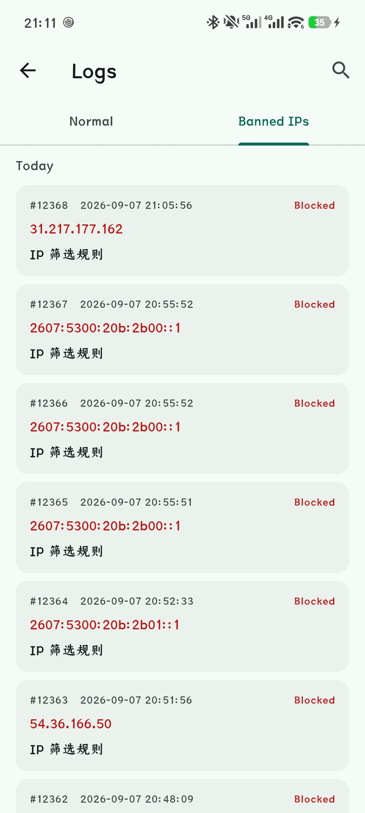<br/>Banned IPs</td>
    <td align="center">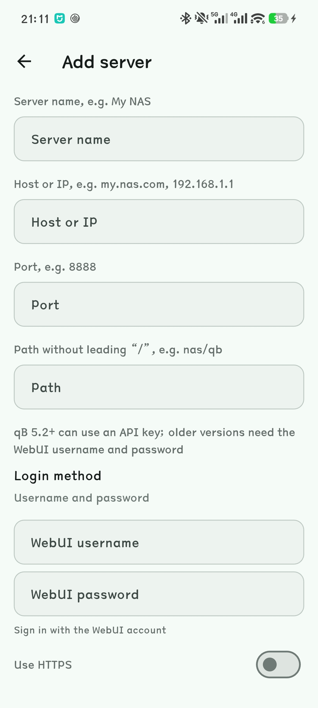<br/>Add server</td>
  </tr>
  <tr>
    <td align="center">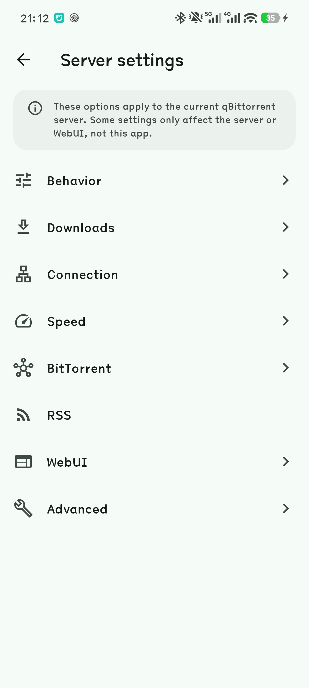<br/>Server settings</td>
    <td align="center">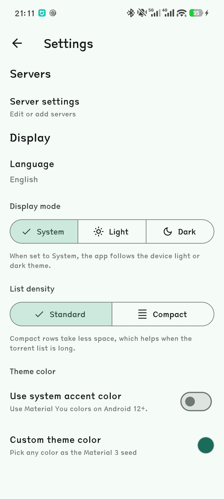<br/>Appearance</td>
    <td align="center">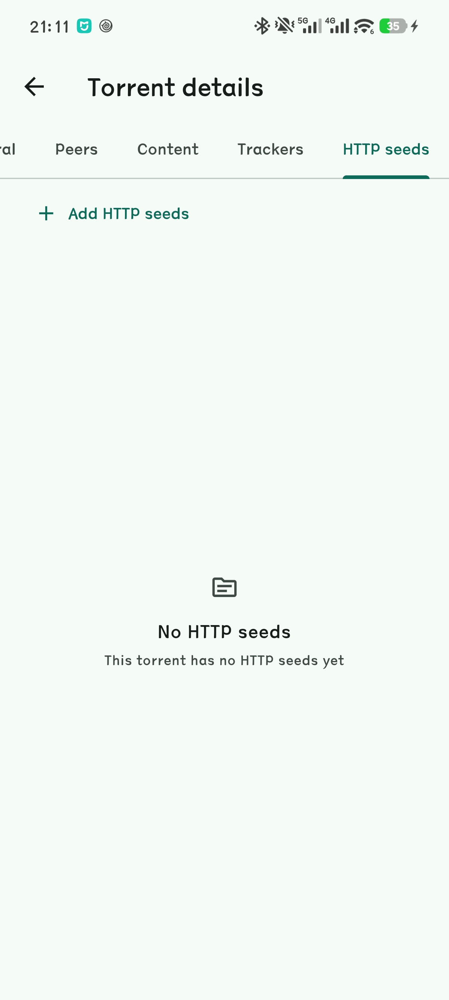<br/>Details · HTTP seeds</td>
  </tr>
</table>

## Usage

1. Enable **WebUI** in qBittorrent (**Tools → Options → WebUI**) and note the port. If you use HTTPS or a reverse proxy, note the path as well.
2. In qBPanel, open **Settings → Servers** and fill in a name, host or IP, port, and path.
3. Choose a login method: username and password, or an API key (qB 5.2+). Turn on **Use HTTPS** when the WebUI is served over TLS.
4. Save, then manage torrents from the home screen. If no server is active, add one first—API calls require an active server.

LAN, a mesh VPN such as Tailscale, or a public URL that already exposes WebUI all work. Protect the WebUI yourself (strong password or API key; do not put an unhardened WebUI on the public internet).

## Platforms

| Platform | Notes |
|---|---|
| **Android** | Primary target. Can open / share `.torrent` files and magnet links |
| **Windows** | Supported. Import via launch arguments or drag-and-drop; no registry default-handler registration |
| **iOS** | Project is in the tree; CI builds unsigned debug. Device / TestFlight need signing |
| **Web** | Present in the tree; limited (no local files / inbound open) |

## Build

Requires [Flutter 3.9+](https://docs.flutter.dev/get-started/install).

```bash
flutter pub get
flutter run
```

Release builds:

```bash
flutter build apk
flutter build windows
flutter build ios --no-codesign
```

## Compatibility

- Minimum **qBittorrent 4.1** (WebAPI 2.0)
- Features light up from the server’s reported WebAPI version (search, tags, peer list, API key, and so on)
- qB 5.0+ uses `start` / `stop`; older builds use `resume` / `pause`

## Disclaimer

This project is not affiliated with qBittorrent. Follow local law and copyright rules. Before downloading via search plugins, make sure the source is legal in your jurisdiction.

## Privacy policy

[Privacy Policy](https://scatl.github.io/qBPanel/privacy-policy.html)

## Acknowledgements

Thanks to [Cursor](https://cursor.com) 😊
